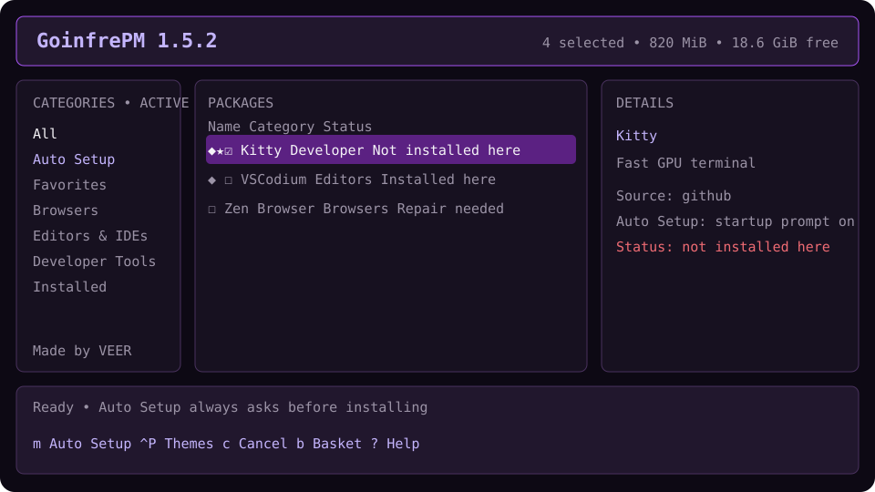

# GoinfrePM

GoinfrePM is a terminal package manager for Ubuntu-based 1337/42 workstations.
It downloads and extracts large applications into writable goinfre storage.
Run-only npx launches also keep the Python environment there; only small state,
launchers, icons, and command links remain in home storage. A permanent manager
install is optional. It does not install system packages or require
administrator access.

Version 1.5 adds **Auto Setup**: an explicit roaming list of applications that
GoinfrePM offers to install when its interactive TUI starts on another post. It verifies
the current post's payload and executable before claiming an app is installed,
so a profile in the user's home directory can never create a false Installed
status. Starter Packs and the basket still require review before installation.

> Project identity is centralized in `src/goinfre_pm/project.conf`, while npm's
> required publishing metadata lives in `package.json`.



## Why use it

School home-directory quotas are small, while `/goinfre` (or the campus-provided
`~/goinfre` link) is intended for larger temporary data. GoinfrePM keeps app
payloads there, while its small local manager integrates applications with the
desktop and shell without changing the operating system.

## Storage layout

The root is selected in this order: writable `$GOINFRE`, writable
`/goinfre/$USER`, an existing writable `$HOME/goinfre`, or a path you select.
The project directory name is appended to automatically detected base paths.
No large-payload fallback is silently created in ordinary home storage.

```text
<selected-root>/
├── apps/       # extracted applications
├── downloads/  # operation-scoped temporary downloads
├── runtime/    # root-local install manifest and operation lock
├── venv/       # Python environment when launched through npx
└── logs/       # per-package logs
```

With `npx goinfre-pm`, the reusable Python environment lives at
`<selected-root>/venv`; no permanent `gpm` command is created. If you explicitly
install the manager, its runtime lives at `~/.local/share/goinfre-pm` and its
launcher at `~/.local/bin/gpm`. Small state and desktop integration live under
`~/.config/goinfre-pm`, `~/.local/share/applications`, and
`~/.local/share/icons`. Roaming state contains only preferences such as Auto
Setup, the selected UI theme, favorites, onboarding, and update cache. This
file remains only a few kilobytes. Installed-package records live
in `<selected-root>/runtime/installed.json`, beside the payloads they describe.

On migration from 1.4, an old home-state installation is imported only when its
payload and executable are verified in the current root. Old `desired` entries
are never silently enrolled into Auto Setup; existing users begin with an empty,
disabled setup until they explicitly choose packages.

## Run with npx (no permanent manager install)

After the `goinfre-pm` package has been published to npm, a peer can open it
without installing a permanent `gpm` command:

```sh
npx goinfre-pm
```

The first form may ask for confirmation before npm downloads the package. To
accept that prompt non-interactively and explicitly request the newest release:

```sh
npx --yes goinfre-pm@latest
```

Arguments are forwarded to GoinfrePM, so non-interactive use works too:

```sh
npx --yes goinfre-pm@latest doctor
npx --yes goinfre-pm@latest install zen-browser
npx --yes goinfre-pm@latest leave
```

On an ordinary interactive launch, the TUI checks Auto Setup and shows a prompt
listing every app that is not ready on the current post. Nothing is installed
until the user chooses **Install now**. The same window then stays open and
shows each app moving through waiting, download, installation, and ready or
failed states. To skip that startup check once:

```sh
npx --yes goinfre-pm@latest --no-restore
```

List, search, doctor, version, and other noninteractive commands never show the
prompt or install Auto Setup applications.

The npm package contains the project files. Its run-only path checks the
workstation, creates or reuses a Python environment in the selected goinfre
root, and launches the code from the npm package. It does **not** create
`~/.local/bin/gpm`, write a manager runtime in `~/.local/share`, or change
`.bashrc`, `.zshrc`, or Fish configuration. It keeps only small preferences in
`~/.config/goinfre-pm`. npm itself may cache the small package under `~/.npm`;
application payloads and the Python environment stay in goinfre. On a new
post, the environment may need to be recreated, so the first launch needs
PyPI access; later launches on the same post reuse it. The bootstrap prints
only a few friendly status lines. Detailed Python environment and dependency
output is saved to `<selected-root>/logs/bootstrap.log`; any setup failure
prints that exact path.

Before leaving a shared workstation, use **Clean this post before leaving** from
the Ctrl+P palette, press `x` in the TUI, or run:

```sh
npx goinfre-pm leave
```

This recommended manual cleanup removes GoinfrePM application payloads,
downloads, logs, runtime files, its goinfre virtual environment, and
manager-created launchers from the current post. It preserves the small Auto
Setup list, theme, favorites, and ordinary application profiles in the user's
home so the next post can be prepared again. It never purges application
configuration or cache. Scripts may use `leave --yes`; interactive use asks
for explicit confirmation.

To deliberately install a permanent `gpm` command, use:

```sh
npx --yes goinfre-pm@latest --install-manager
```

That explicitly runs the idempotent installer, creates the home-based manager
runtime and `~/.local/bin/gpm`, and adds `~/.local/bin` to Bash, Zsh, and Fish
PATH configuration. Then `gpm` works from any directory. To repair that
explicit installation, add `--reinstall`:

```sh
npx --yes goinfre-pm@latest --install-manager --reinstall doctor
```

Plain `npm install goinfre-pm` installs the npm wrapper into the current
project; it does not install the Python manager or create a system-wide `gpm`.
`npm install -g goinfre-pm` makes the npm wrapper global only when your npm
prefix is writable, which may not be true on school machines. The explicit
`--install-manager` option avoids that ambiguity and never needs sudo.

To remove a previously installed permanent manager while retaining
applications and state:

```sh
npx --yes goinfre-pm@latest --uninstall-manager
```

Upgrading from an older release does not silently remove an existing `gpm`
launcher or its shell PATH lines; use this explicit removal command if you
want to switch fully to run-only mode. Version 1.5.8 retires and removes the old
login-autostart entry automatically because it could race the visible Auto Setup.

## Prerequisites

The supported target is Ubuntu 22.04 on x86_64. The workstation needs Node.js
and npm to provide `npx`, plus the standard Ubuntu Python 3.10 or newer. No
sudo, system pip, `python3-venv`, or curl is required. The installer creates its
private environment with `--without-pip`, then bootstraps a pinned pip wheel
from official PyPI and verifies its SHA-256 before using it. Runtime and build
dependencies are exact-version pinned for reproducible student installs.

Verify the result with:

```sh
node --version
npm --version
npx --version
python3 --version
dpkg-deb --version
```

`dpkg-deb` is optional and only needed for applications distributed as `.deb`.
GoinfrePM and its npm bootstrap never invoke `sudo` or `apt`. If Node, Python,
or `dpkg` is missing from a managed workstation, ask school staff to restore
that standard Ubuntu tool. Network access to npm is needed when the npm package
is not cached, and PyPI access is needed when the goinfre Python environment
must be created or repaired. At least 256 MiB must be free before setup
(individual applications need more).

To print this list without installing GoinfrePM, run:

```sh
npx --yes goinfre-pm@latest --requirements
```

## Installation from a clone

The npm route is optional. From a local checkout, run without a permanent
command using `sh install.sh run`, or explicitly install one with:

```sh
chmod +x install.sh
./install.sh
```

The installer prefers these local files, creates the small persistent virtual
environment under `~/.local/share/goinfre-pm`, installs pinned dependencies,
creates `~/.local/bin/gpm`, and adds
`~/.local/bin` to Bash, Zsh, and Fish configuration exactly once. Existing
shell files are backed up before modification. Open a new terminal and run:

```sh
gpm
```

For a manually chosen non-interactive root:

```sh
GPM_INSTALL_ROOT="/path with spaces/goinfre-pm" ./install.sh
```

Running `./install.sh` again updates the existing environment and launcher.

The explicit installer removes a previous goinfre-based manager environment
only after the persistent local runtime has passed its startup check. A later
run-only npx launch can recreate its goinfre environment. Application payloads
and state are not removed.

## TUI controls

| Key | Action |
|---|---|
| `↑`/`↓`, `j`/`k` | Navigate packages |
| `→` / `←` | Move focus from categories to packages / back to categories |
| `Space` | Select or deselect (`☐` / `☑`; favorites show `★`) |
| `/` | Search |
| `Enter` | Open actions for an installed desktop application |
| Mouse double-click | Install the available package under the pointer |
| `i` / `Alt+I` | Install highlighted or open installed-app actions / review selected basket |
| `r` / `Alt+R` | Confirm and remove highlighted / selected installed packages |
| `a` | Select/deselect visible packages |
| `p` | Choose and persist install root |
| `t` | Open Starter Packs |
| `b` | Review the current basket and storage estimate |
| `f` | Add/remove the highlighted package from persistent favorites |
| `m` / `M` | Toggle highlighted in Auto Setup / add selected packages to Auto Setup |
| `c` | Cancel the current install or remaining Auto Setup restoration |
| `Ctrl+P` | Open the palette and choose Purple, Green, Blue, Black, or Red |
| `s` | Sort by name, category, installed state, size, or updates |
| `d` | Open the visual Doctor |
| `l` | Focus detailed logs |
| `w` | Reopen the welcome guide |
| `?` | Show help |
| `Esc` | Close search/modal or move back to categories |
| `x` | Clean GoinfrePM data from this post and leave |
| `q` | Exit; when post-local data exists, choose Clean & exit, Exit without cleaning, or Cancel |

The layout hides lower-priority navigation/details panels at small terminal
widths and remains usable around 80×24. Conflicting install, removal, path, and
cleanup actions are blocked while a worker is active, but navigation, package
selection, favorites, and Auto Setup editing remain available. Quitting waits
for the worker to finish. The focused
category or package pane has a bright border and an `ACTIVE` title. Removal
confirmations leave user configuration intact. Download operations show bytes,
speed, and ETA when the server supplies a total; batch operations end with a
success/failure summary. Unknown catalog sizes are labeled unknown rather than
guessed.

The header continuously shows GoinfrePM's approximate post-local storage use
and the `x Clean & leave` reminder. After installation and Auto Setup summaries,
the same reminder is shown again. Cleanup never runs merely because a terminal
closed or a user logged out.

Installed applications cannot be accidentally installed again. The basket
skips them, while `Enter` or `i` opens a concise **Launch / Update / Reinstall /
Repair / Cancel** dialog for installed desktop applications. Launch starts only
the verified executable inside that package's goinfre directory and never uses
a shell. Reinstall preserves the user's profile and cache and uses the same
staging, atomic replacement, and rollback path as updates.

Doctor reports safely reclaimable storage and shows one **Clean** button only
when cleanup is available. Cleanup is limited to interrupted downloads, hidden
installation staging/backup directories created by GoinfrePM, and package logs
older than 30 days. It reacquires the normal operation lock and rescans before
deleting. Installed applications, current logs, user profiles, configuration,
and files outside the selected goinfre root are never cleanup targets.

Automatic update comparison is available for GitHub-release packages. Direct,
pinned vendor downloads are shown as **catalog-managed** because their upstream
version cannot be compared reliably; a temporary GitHub/network failure is
shown as **check unavailable** instead of the ambiguous “update unknown”.

Starter Packs are curated shortcuts for **42 C/C++**, **Web Development**,
**Minimal Terminal**, and **Creative** workflows. Press `t`, inspect a pack,
then press `Enter` or `Space` to add its compatible packages to the basket.
Press `b` to review and install. Favorites are stored atomically in the small
state file and appear in the dedicated Favorites category.

## Auto Setup and changing posts

`Auto Setup` is different from the temporary basket and Favorites. Add the
highlighted package with `m`, or select several packages with Space and press
`M`. Mouse users can click the context-aware Auto Setup button in the details
pane. The diamond marks Auto Setup membership. Adding a package explicitly
enables the interactive-launch prompt; `gpm setup disable` pauses it without
forgetting the list.

At interactive startup GoinfrePM checks the selected root and classifies each
package as **Installed here**, **Repair needed**, or **Not installed here**. A
home-directory profile (for example Zen Browser's settings) is not installation
evidence. If any Auto Setup apps are absent or need repair, a modal lists their
names and asks **Set up this post?** Choose **Install now** to continue or **Not
now** to open GoinfrePM without changing application files. After confirmation,
that same modal becomes the live installer: apps are handled sequentially with
per-app state, progress, safe cancellation, and a final success/failure/skipped summary. Detailed logs
also remain available in the task panel. Choose **Browse packages** to keep using
the catalog while Auto Setup continues in the same process. Healthy payloads are
never redownloaded or automatically updated; broken integration is repaired
without downloading.

Failures do not stop later packages. They are shown as Auto-install failed for the
current session and may be retried on the next launch or with `gpm setup
restore`. A root-local lock prevents overlapping changes. If another session
is already restoring apps, Auto Setup waits and then checks what is still
missing; it does not report the lock as a package failure. A visible progress
window remains open for the complete operation, mirrors package progress when
available, and clearly says when it is waiting. It does not give up after an
arbitrary 30-second timeout: once the earlier safe operation exits, this window
automatically installs anything still missing. You can cancel safely while
waiting. Old login-autostart entries are removed when the new manager launches so this
background race cannot return.

Press `Ctrl+P` and choose **Theme: Purple**, **Green**, **Blue**, **Black**, or
**Red**, plus **Light mode** or **Dark mode**. Purple and dark mode are the
defaults. Both preferences are stored as short values in the same small roaming
preferences file, so they return after `npx goinfre-pm` and on another post.
Package payloads and installed-state manifests are never moved into the
quota-limited home directory for appearance customization.

## Command-line interface

The commands below use `gpm` after an explicit manager install. In run-only
mode, replace `gpm` with `npx goinfre-pm` (for example,
`npx goinfre-pm doctor`).

```text
gpm
gpm list
gpm search <query>
gpm install <package>...
gpm remove <package>... [--keep-setup] [--purge-cache] [--purge-config]
gpm update <package>...
gpm update --all
gpm reinstall <package>...
gpm repair
gpm restore
gpm setup list
gpm setup add <package>...
gpm setup remove <package>...
gpm setup restore
gpm setup enable
gpm setup disable
gpm --no-restore
gpm path
gpm path set <directory>
gpm autostart disable
gpm leave [--yes]
gpm doctor
gpm version
```

Before leaving a shared post, press `x` in the TUI or run `npx goinfre-pm leave`.
Both paths require explicit confirmation. Pressing `q` also offers a
three-way choice when removable post-local data exists: **Clean & exit**,
**Exit without cleaning**, or **Cancel**. Cleanup removes manager-owned payload,
download, log, runtime, virtual-environment, launcher, icon, and desktop-entry
files. It preserves the small roaming Auto Setup/theme/favorites state and does
not delete ordinary application profiles or cache.

`restore` is a compatibility shortcut for `setup restore`; both restore only
missing Auto Setup packages. `update` resolves the catalog's current release,
`reinstall` explicitly replaces the payload even when its catalog version has
not changed, and `repair` recreates root-local metadata, command links, and
desktop integration without downloading. All preserve ordinary user profiles.

Normal removal also removes the package from Auto Setup so it does not return on
the next launch. The TUI offers **Remove + forget**, **Keep in Auto Setup**, and
Cancel; CLI users can request the second behavior with `--keep-setup`.
Configuration and cache purge remain separate explicit allowlisted options.
Background login restore is retired because an invisible process could race the
interactive Auto Setup. `autostart disable` remains as an idempotent cleanup
command; `autostart enable` now explains why the visible prompt should be used.

## Package catalog

`packages.toml` uses one `[[package]]` table per package:

```toml
[[package]]
id = "example-tool"
name = "Example Tool"
description = "What this package does."
category = "Developer Tools"
url = "https://github.com/example/tool"
source_type = "github"
asset_pattern = 'linux-x86_64\.tar\.gz$'
architectures = ["x86_64"]
executables = ["bin/example-tool"]
icons = ["share/icons/example.png"]
desktop = false
terminal = true
version = "latest"
enabled = true
# Optional byte counts for basket estimates:
download_size = 12345678
installed_size = 34567890
# Optional integrity pin for stable direct downloads:
sha256 = "0123456789abcdef0123456789abcdef0123456789abcdef0123456789abcdef"
```

Supported source types cover Debian archives (`dpkg-deb -x`), AppImages, tar.gz,
tgz, tar.xz, tar.bz2, ZIP, direct executables, and latest GitHub release assets.
Identifiers must be lowercase, path-safe, and unique. Architecture is checked
before download. GitHub `asset_pattern` should narrowly select the correct Linux
asset. Direct pinned URLs in the catalog carry review notes when they may be
stale. `download_size` and `installed_size` are optional; omit them if not
verified. `sha256` is optional, but recommended for immutable direct URLs. A
checksum mismatch deletes the download and aborts before extraction.

Set `enabled = false` for a retired entry that must remain known so an existing
installation can still be repaired or removed. Disabled packages are hidden
from the available catalog, rejected on install, and skipped during restore.

Optional post-install behavior is limited to structured `chmod` and internal
`symlink` actions. Legacy configuration migration is available through
`goinfre_pm.config.migrate_legacy_config`; legacy shell fragments are reported
and disabled, never executed.

## Updating and uninstalling

For run-only users, rerun the npx command after the maintainer publishes a new
version. It uses that package's code and reuses the goinfre Python environment
when the pinned dependencies have not changed. It does not install or update a
permanent `gpm` command. Applications and state are preserved:

```sh
npx --yes goinfre-pm@latest
```

If you previously chose a permanent manager installation, update it explicitly
after publication:

```sh
npx --yes goinfre-pm@latest --install-manager
```

For users who installed from a clone, do not clone it again on each school
machine. Update the existing checkout and rerun the idempotent installer:

```sh
cd /path/to/goinfre-pm
git pull --ff-only
./install.sh
```

The explicit install updates the persistent local virtual environment,
application code, catalog, and `~/.local/bin/gpm` launcher while retaining
installed applications, Auto Setup preferences, the UI theme, and user
configuration. For an existing Zen installation, first
repair its command link without downloading it again. If it still fails, replace
the payload from the corrected official latest-release URL:

```sh
gpm repair
gpm update zen-browser
```

Use `gpm update --all` to refresh every installed application. Application
replacement is staged and rolled back if integration fails.

Use `gpm reinstall <package>` for an explicit fresh extraction of a healthy
installed payload. Unlike Auto Setup restore, reinstall is never automatic.

### Spotify on Ubuntu 22.04

The Media catalog includes Spotify's own
`download.spotify.com` build `1.2.74.477.g3be53afe`, pinned by SHA-256. The
package declares `libc6 >= 2.30`, and inspection of its x86_64 executable found
no GLIBC symbol newer than 2.30, which fits Ubuntu 22.04's glibc 2.35. Newer
Spotify repository builds currently require newer glibc and are intentionally
not selected. Spotify still relies on ordinary desktop libraries already
provided by the campus Ubuntu image; if one is missing, GoinfrePM will not use
sudo to add it. Existing Spotify settings and login data under
`~/.config/spotify` are preserved during normal install, update, and removal.

```sh
./install.sh uninstall
# Or, from npm: npx goinfre-pm --uninstall-manager
```

That removes an explicitly installed local manager runtime and `gpm` launcher even when goinfre is
unavailable, but retains applications and state. `./install.sh uninstall
--purge-data` also removes application
payload directories from the selected root. Shell PATH lines and small state
are deliberately retained for safety and possible reinstall.

## Security model and limitations

- Downloads require HTTPS with normal certificate validation, timeouts, and
  operation-specific temporary directories.
- Tar and ZIP extraction rejects absolute paths, traversal, special devices,
  unsafe links, and ZIP symlinks.
- Installs are staged and atomically swapped; failed updates restore the prior
  payload where possible.
- Installed state is root-local and is accepted only when the payload contains
  a valid executable inside the selected root. Roaming home preferences cannot
  claim an application is installed.
- A root-local exclusive operation lock prevents two manager processes from
  mutating the same payload tree concurrently. Lock metadata includes the
  workstation and Linux boot identity so a lock carried through goinfre from
  an older post cannot be confused with an unrelated process that reused its
  PID.
- Application removal only targets the exact validated app directory and
  manager-owned integration filenames. Configuration purge needs an explicit
  CLI flag, package opt-in, and an allowlisted path that clearly matches the
  package.
- Fixed downloads can carry a SHA-256 pin (Spotify does); rolling URLs and
  GitHub assets still rely on HTTPS and upstream release controls rather than
  package signatures. GoinfrePM does not claim to establish publisher trust.
- Extracted apps may still depend on system libraries unavailable on a campus
  image. GoinfrePM cannot supply privileged OS packages.
- GitHub asset matching and pinned vendor URLs can become stale. Review catalog
  notes and upstream release pages before adding or refreshing a package.

Run `gpm doctor` to inspect the root, permissions, free space, Python, external
commands, PATH, state, integrations, catalog validity, and architecture.

## Troubleshooting

- **No root found:** mount or create the campus goinfre location, then run
  `gpm path set "/your/writable/goinfre-pm"`.
- **`gpm: command not found` after npx:** this is expected in run-only mode.
  Use `npx goinfre-pm` again, or explicitly run
  `npx goinfre-pm --install-manager` to create `gpm`.
- **`gpm` missing after an explicit install:** open a new shell or temporarily
  run `export PATH="$HOME/.local/bin:$PATH"`.
- **A previous install says `No module named pip`:** run
  `npx --yes goinfre-pm@latest` again. Version 1.2.1 and newer detects and
  repairs the incomplete environment without sudo.
- **Application does not launch:** inspect `<root>/logs/<package>.log`, run
  `gpm doctor`, then `gpm repair`.
- **An app was installed on another post:** add it to Auto Setup once with `m` or
  `gpm setup add PACKAGE`. On the new post the startup prompt lists it; choose
  **Install now**, or run `gpm setup restore` when you are ready.
- **Unexpected old Installed status:** version 1.5 no longer trusts roaming
  installation records. Run `gpm doctor`; a valid payload with missing metadata
  is shown as Repair needed, while an absent payload is Not installed here.
- **Hide the Auto Setup prompt:** run `gpm setup disable`, or use
  `npx goinfre-pm --no-restore` for one launch. Re-enable it later with
  `gpm setup enable`.
- **The TUI closes unexpectedly:** inspect `~/.config/goinfre-pm/crash.log`.
  Unexpected failures are recorded there without dumping a traceback over the
  terminal interface.
- **Stale package URL:** update only that package entry after verifying the
  publisher and architecture.

The project stays MIT-licensed so anyone can legally use, modify, and share this
casual tool. See `LICENSE`; third-party packages keep their own terms.

## Publishing the npx bootstrap (maintainer only)

The npm name `goinfre-pm` was unclaimed when this wrapper was added, but registry
names are first-come, first-served. Publishing is a separate authenticated step;
committing or pushing to GitHub does not publish npm automatically.

Before each release, keep the version identical in `package.json`,
`pyproject.toml`, and `src/goinfre_pm/project.conf`, run the checks, then:

```sh
npm login
npm whoami
npm test
npm pack --dry-run
npm publish --access public
npm view goinfre-pm version --registry=https://registry.npmjs.org/
```

For the next release, increment all three versions first; npm will reject reuse
of an already published version. Never publish from an untrusted checkout or
commit npm access tokens to this repository.
